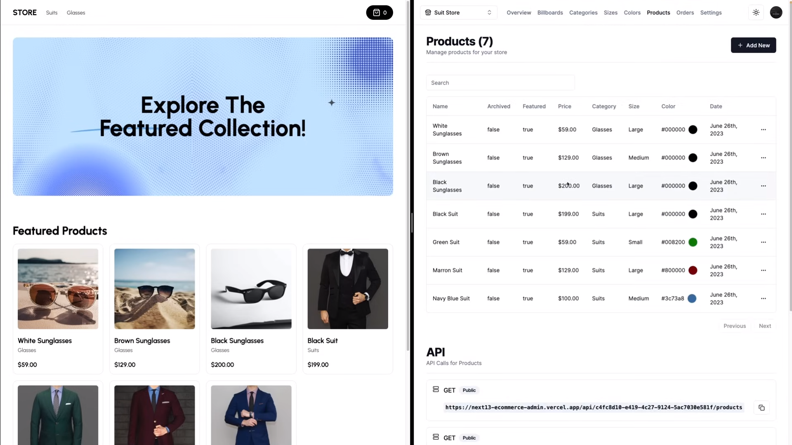

# [The Next Shop / Dashboard](https://the-next-shop-dashboard.vercel.app/)

# [The Next Shop / Store](https://the-next-shop-store.vercel.app/)

# Full Stack E-Commerce + Dashboard & CMS: Next.js 14, Tailwind, Drizzle ORM, PostgreSQL.

[](https://the-next-shop-store.vercel.app/)

## Tech Stack

- **Framework:** [Next.js](https://nextjs.org)
- **Styling:** [Tailwind CSS](https://tailwindcss.com)
- **Authentication:** [Lucia](https://lucia-auth.com/)
- **ORM:** [Drizzle ORM](https://orm.drizzle.team)
- **UI Components:** [shadcn/ui](https://ui.shadcn.com)
- **Payments infrastructure:** [Stripe](https://stripe.com)
- **Database:** [Neon (Serverless Postgres)](https://neon.tech/)

1. Clone the dashboard repository

   ```bash
   git clone https://github.com/devSaifur/dashboard.git
   ```

1. Clone the store repository

   ```bash
   git clone https://github.com/devSaifur/store.git
   ```

1. Install dependencies using pnpm

   ```bash
   pnpm install
   ```

1. Start the development server

   ```bash
   pnpm run dev
   ```
